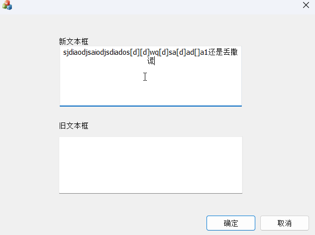

# CMyEdit
本项目基于vs2026创建,使用vs2026/vs2022打开`CMyEdit.slnx`/`CMyEdit.sln`即可打开项目,需要安装`MSVC v143 - VS 2022 C++ x64/x86 生成工具`
随手问ai,5分钟拼出来的,代码质量非常差,请见谅(

给`Edit Control` 添加 `ctrl`+`backspace` 删除单词功能,并提供了可能更优的的undo和redo实现
- 是通过实现一个 `Edit Control` 子类来实现上述功能的
- `ctrl`+`backspace`删除光标前的一个单词,目前仅支持以英文符号作为分隔符,未考虑utf-8和Unicode字符
- undo和redo功能是通过维护一个删除操作栈来实现的,每次删除操作都会被记录到栈中,当按下`ctrl`+`z`时,会从栈中弹出最近的删除操作并恢复文本,当按下`ctrl`+`y`时，会从栈中重新应用最近一次被撤销的删除或修改操作.可通过`MAX_HIST`设定栈的大小控制最大记录次数
- 启动程序后会有两个文本框,`新文本框`为使用了`MyEdit`子类的文本框,`旧文本框`为普通的`Edit Control`,可以对比两者的功能差异

